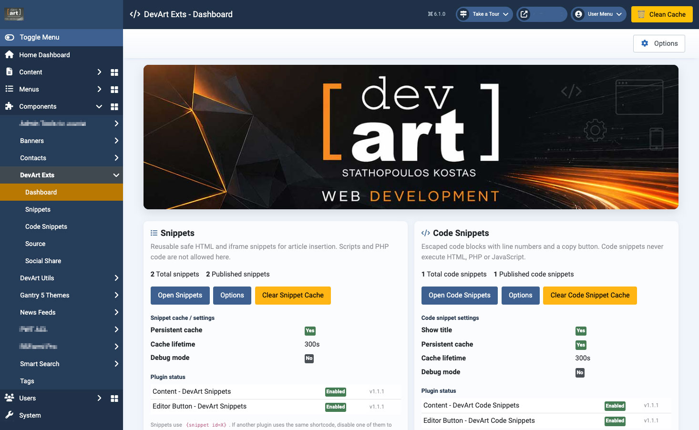
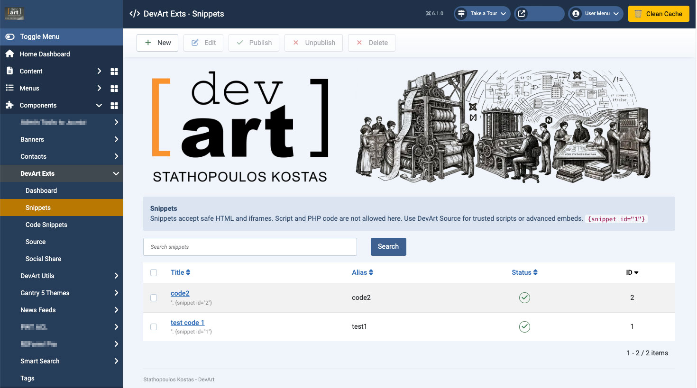
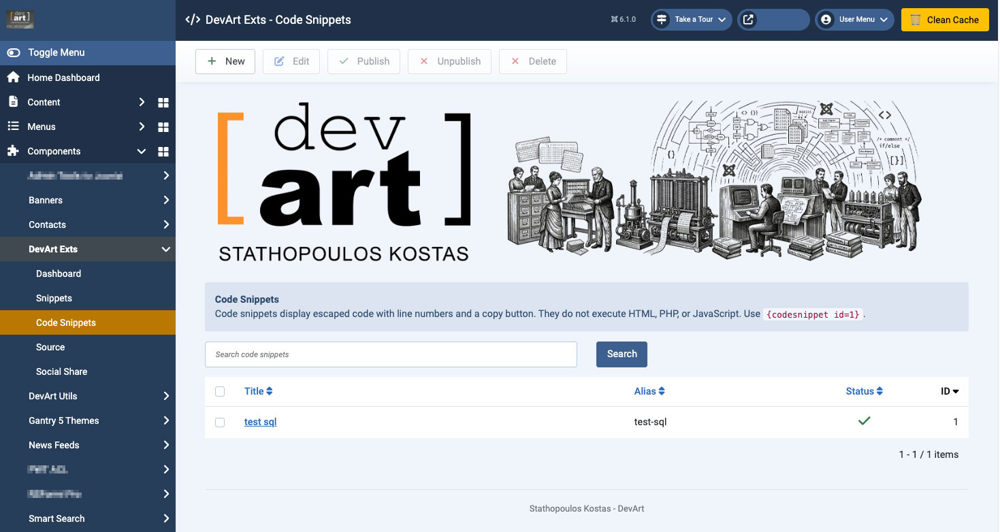
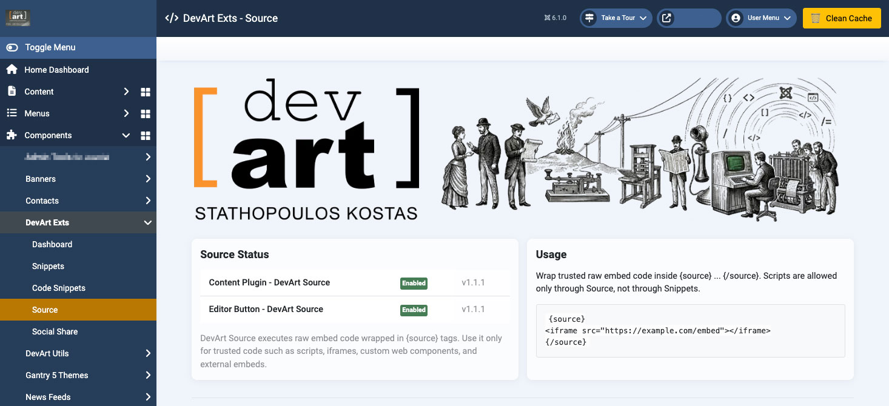
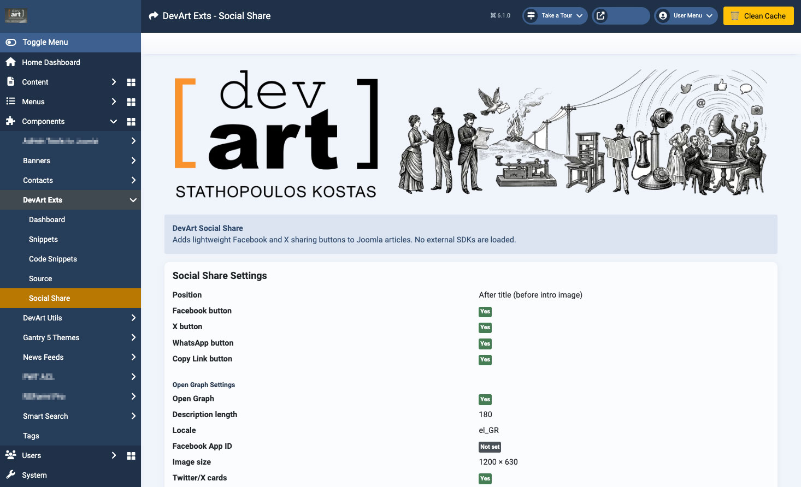
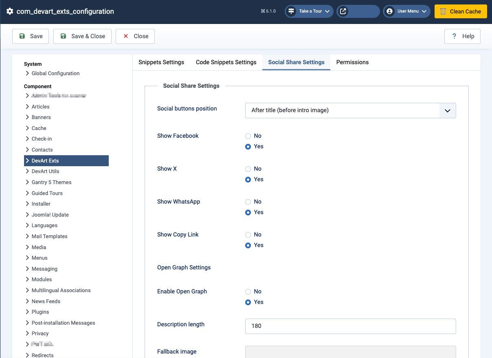

# DevArt Exts for Joomla

Lightweight extension suite for Joomla 6, designed for high-performance editorial websites.

---

## Overview

DevArt Exts is a modular package of Joomla 6 extensions built for safe content insertion, code display, and social sharing with minimal overhead.

Designed for stability, security, and performance on high-traffic Joomla websites.

---

## Documentation

Full manual available here:

[Download Manual PDF](docs/manual_v1.1.7.pdf)

Includes:
- Dashboard overview
- Snippets usage
- Code Snippets
- Source embeds
- Social Share & Open Graph
- Settings & performance tuning

---

## Features

### Snippets
- Reusable safe HTML and iframe blocks
- Article shortcode: {snippet id=X}
- Editor button integration
- No script or PHP execution
- Optional caching

### Code Snippets
- Escaped code blocks
- Line numbers support
- Copy-to-clipboard button
- Article shortcode: {codesnippet id=X}
- Safe display without code execution
- Optional caching

### DevArt Source
- Raw embed support for trusted code
- Supports scripts, iframes and widgets
- Example: {source}<iframe src="https://example.com/embed"></iframe>{/source}

### Social Share
- Facebook, X, WhatsApp, Copy Link
- No external SDKs
- Lightweight and fast
- Configurable position

### Open Graph
- Automatic Open Graph meta tags
- Compatible with Joomla Page Cache and CDN caching
- Title, description and image support
- Twitter/X cards
- Safe extraction from raw article data
- Optional fallback image

---

## Included Extensions

This package installs:

- com_devart_exts
- plg_content_devartsnippets
- plg_editors-xtd_devartsnippetsbutton
- plg_content_devartcodesnippets
- plg_editors-xtd_devartcodesnippetsbutton
- plg_content_devartsource
- plg_editors-xtd_devartsourcebutton
- plg_content_devartsocial
- plg_system_devartopengraph

---

## Requirements

- Joomla 6.x
- PHP 8.1+

---

## Installation

1. Download the latest release from GitHub
2. Go to System → Extensions → Install
3. Upload the package zip file
4. Open Components → DevArt Exts
5. Configure settings
6. Enable required plugins

---

## Joomla Updates

DevArt Exts supports Joomla's native update system via GitHub.

Once installed, future updates will be available via:

System → Extensions → Update

---

## Shortcodes

Snippet: {snippet id=1}

Code Snippet: {codesnippet id=1}

Source: {source}{/source}

---

## Security Highlights

- No script execution in Snippets
- Code Snippets are fully escaped
- Raw code only allowed via DevArt Source
- Joomla ACL and CSRF protection
- GPL licensed and JED compliant
- Safe database handling

---

## Performance

- No external libraries
- Minimal frontend impact
- CDN and Cloudflare friendly
- Compatible with Joomla Page Cache
- Designed for high-traffic production environments

---

## Recommended Cache Setup

For production sites using Joomla Page Cache:

- Joomla Page Cache: ON
- Joomla Gzip Page Compression: OFF if server or CDN compression is already enabled
- Server or Cloudflare compression: ON

This avoids double-compression issues while keeping cached pages fast.

---

## Screenshots

### Dashboard

### Snippets

### Code Snippets

### Source

### Social Share

### Settings

---

## Current Version

1.1.7

---

## Changelog 1.1.7

- Fixed Open Graph corruption when Joomla Page Cache is enabled
- Fixed random or garbled characters in og:description under cached responses
- Fixed frontend break caused by invalid cached output
- Open Graph metadata now generated from raw Joomla article data
- Improved compatibility with Joomla Page Cache and Cloudflare
- Improved stability with Snippets and Source plugins
- JED compliance retained with GPL license headers and manifests

---

## Author

Kostas Stathopoulos  
DevArt  
https://devart.gr/

---

## License

GNU General Public License v3 or later
